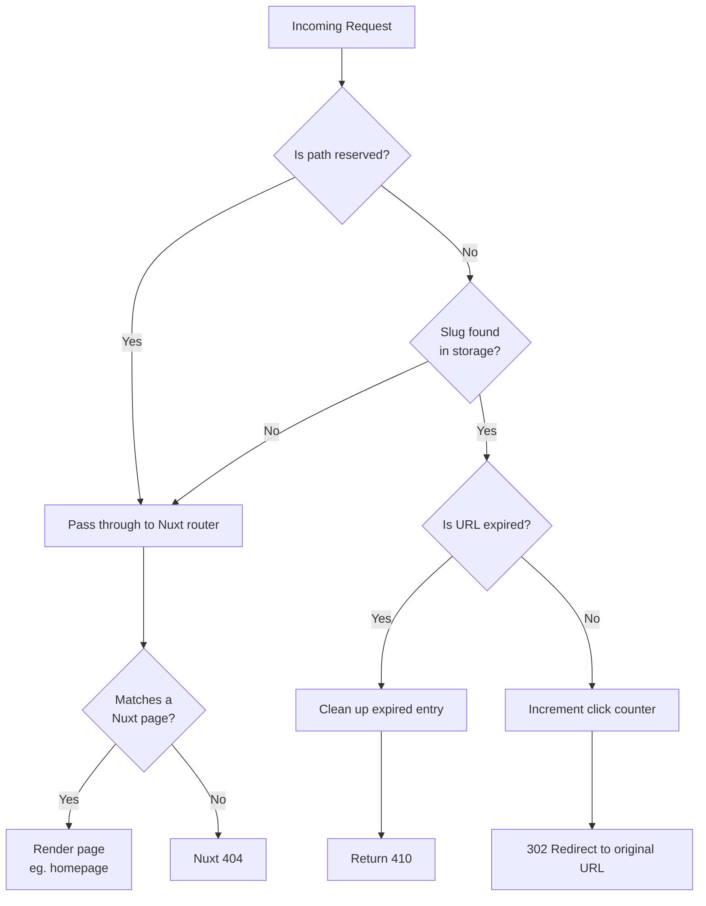

# Hubexo URL Shortener

## Setup

### Install dependencies:

```bash
# npm
npm install

# pnpm
pnpm install

# yarn
yarn install

# bun
bun install
```

### Copy `.env.example` to `.env` and fill in the values:

```bash
cp .env.example .env
```

## Storage

The storage driver is configured with the `STORAGE_DRIVER` env variable. Two drivers are currently supported: `fs` (default) and `redis`.

> **Note:** In development (`ENVIRONMENT=dev`), the app always uses the `fs` driver regardless of `STORAGE_DRIVER`. Optionally set `DEV_STORAGE_BASE_PATH` to override the default storage path.

### Filesystem (default)

No additional config setup is required. Data is stored locally on disk.
```bash
STORAGE_DRIVER=fs

STORAGE_BASE_PATH=./data/urls 
```

### Redis

Requires a running Redis instance. Set the driver and connection URL:

```bash
STORAGE_DRIVER=redis

REDIS_URL=redis://127.0.0.1:6379
```

## Development Server

Start the development server on `http://localhost:3000`:

```bash
# npm
npm run dev

# pnpm
pnpm dev

# yarn
yarn dev

# bun
bun run dev
```

## Production

Build the application for production:

```bash
# npm
npm run build

# pnpm
pnpm build

# yarn
yarn build

# bun
bun run build
```

Locally preview production build:

```bash
# npm
npm run preview

# pnpm
pnpm preview

# yarn
yarn preview

# bun
bun run preview
```

## Design and build process

Some preliminary [research](https://medium.com/@sandeep4.verma/system-design-scalable-url-shortener-service-like-tinyurl-106f30f23a82) of what constitutes a URL shortener and how it should be built.

First thought was instantly that it should be persisted as a key/value format, Redis being the first to come to mind because it's a good choice for caching, fast, uses RAM and is easy to deploy.

Chose to use Nuxt for this project and utilised the Nitro server to build the API, with Vue components handling the frontend form and result display.

### Storage

Redis was chosen as the primary storage driver for a few key reasons:

- The entry model is a perfect fit, a URL shortener is fundamentally just a key/value mapping of `slug -> url`
- Reads are served from memory, making redirects sub-millisecond
- Redis has native TTL support, which made it easy to implement URL expiry
- It scales horizontally - multiple server instances all share the same Redis instance

A filesystem driver is also supported as a fallback for local development or environments without Redis. The storage layer is abstracted behind a `UrlStorage` class so the driver can be swapped via environment variable with no changes to application code.

### Slug generation

Node's `crypto.randomBytes(4)` encoded as `base64url` is used to create slugs, which are 8-character alphanumeric strings with over 4 billion possible combinations (2^32). Up to five retries are allowed before the request fails, and a collision check is done before saving.

To find duplicate URLs without iterating through every key, a reverse lookup key (`url -> slug`) is kept alongside the forward key (`slug -> url`). Regardless of the number of URLs stored, deduplication is therefore a single O(1) lookup.

### Validation

Validation runs server-side through a rule-based pipeline where each rule can either accumulate errors or short-circuit on failure. Rules cover:

- Presence and type checks
- URL length
- Protocol
- Hostname validity
- Localhost/self-reference prevention
- Live reachability check via a HEAD request (with GET fallback for servers that reject HEAD)

URLs are also normalised before validation - if no protocol is present, `https://` is prepended, so users can type `example.com` without getting a validation error.

### API

The API follows a consistent response shape across all outcomes:
```ts
{ success: boolean, errors?: string[], fields?: { key, message }[], ...data }
```

This made wiring up the frontend straightforward, the form handles field-level errors, top-level errors, and success states all from the same response structure.

### Redirecting

Initially, a catch-all route at `server/routes/[slug].get.ts` was used to resolve short URLs. This resulted in an instant issue: a 404 on the homepage because the route was intercepting requests to `/` before the Nuxt page router could process them. The underlying cause was that Nitro processes server routes before the page router, and an empty slug parameter was sufficient to trigger the handler. Several workarounds, such as reserved path lists and origin comparisons, were tried.

Moving the logic to `server/middleware/redirect.ts` was the solution. Every request is handled by middleware, which falls through to the page router for anything that isn't a valid slug and returns early for reserved paths (`api`, `_nuxt`, `favicon.ico`, etc.). Additionally, a failed slug lookup fails instead of returning a 404, so Nuxt handles unknown paths automatically.

When a lookup is successful, the middleware verifies expiration before redirecting, automatically clearing out expired entries for the fs driver in cases where Redis TTL is unavailable. The click counter is increased when a valid slug responds with a `302` redirect.

### Optional enhancements implemented

- **Persistence** - Redis (production) and fs (dev)
- **URL expiry** - optional `expiresIn` field (in days) on the shorten request; Redis handles cleanup via native TTL, with a manual cleanup fallback for the fs driver
- **Click tracking** - every redirect increments a click counter stored alongside the URL entry, queryable via `GET /api/stats/:slug`
- **Scalability** - Redis for horizontal scaling, O(1) deduplication using reverse lookup, and collision-resistant slug generation

### Not implemented

- **Unit testing** - Unit testing was not implemented for this project, it's not something that has been a requirement in my current role and I didn't want to spend time learning and configuring a test setup at the expense of the rest of the app. Saying that, the validator is designed in a way that lends itself well to testing if it were to be added.
- **Rate limiting** - Rate limiting was considered but not implemented. The most practical approach would have been a Redis-backed counter per IP address — incrementing on each request and rejecting with a `429` if the count exceeded a threshold within a given window, using Redis TTL to automatically reset the counter. This was left out because the app is intended for internal use and the risk of abuse is low in that context. For a public-facing deployment it would be an important addition, and the Redis infrastructure is already in place to support it with minimal extra work.

### Decided process

1. Use a form to fetch() the endpoint with the url to shorten, read the url and slug from the form
2. Validate
3. Check if the URL has already been shortened
4. Generate a unique slug
5. Save the URL to the storage
6. Return the shortened URL and any errors for graceful error handling



## Example requests and responses

### Shorten a URL

Request:
```bash
curl -X POST http://localhost:3000/api/shorten \
  -H "Content-Type: application/json" \
  -H "Accept: application/json" \
  -d '{"url": "https://www.google.com"}'
```

Response:
```json
{
    "success": true,
    "existing": false,
    "message": "Your shortened URL is ready:",
    "slug": "twO8UA",
    "short": "http://localhost:3000/twO8UA",
    "expiresAt": null
}
```

---

### With expiry

Request:
```bash
curl -X POST http://localhost:3000/api/shorten \
  -H "Content-Type: application/json" \
  -H "Accept: application/json" \
  -d '{"url": "www.facebook.com", "expiresIn": 30}'
```

Response:
```json
{
    "success": true,
    "existing": false,
    "message": "Your shortened URL is ready:",
    "slug": "NuRmzQ",
    "short": "http://localhost:3000/NuRmzQ",
    "expiresAt": 1774872404844
}
```

---

### Shorten a URL

Request:
```bash
curl -X POST http://localhost:3000/api/shorten \
  -H "Content-Type: application/json" \
  -H "Accept: application/json" \
  -d '{"url": "https://www.google.com"}'
```

Response:
```json
{
    "success": true,
    "existing": false,
    "message": "Your shortened URL is ready:",
    "slug": "twO8UA",
    "short": "http://localhost:3000/twO8UA",
    "expiresAt": null
}
```

---

### Same URL

Request:
```bash
curl -X POST http://localhost:3000/api/shorten \
  -H "Content-Type: application/json" \
  -H "Accept: application/json" \
  -d '{"url": "www.google.com"}'
```

Response:
```json
{
    "success": true,
    "existing": true,
    "message": "This URL has already been shortened:",
    "slug": "twO8UA",
    "short": "http://localhost:3000/twO8UA",
    "clicks": 0,
    "expiresAt": null
}
```

---

### URL stats

Request:
```bash
curl -X GET http://localhost:3000/api/url-stats/twO8UA \
  -H "Content-Type: application/json" \
  -H "Accept: application/json"
```

Response:
```json
{
    "success": true,
    "slug": "twO8UA",
    "url": "https://www.google.com",
    "clicks": 0,
    "createdAt": 1772280116481,
    "expiresAt": null
}
```

## Future improvements

### Dashboard
A view with a simple paginated/searchable table of all shortened URLs would be a good starting point, using the stats endpoint for detail views. Could even be extended into a user area with the ability to extend or delete urls.

### Components
I would have liked to have abstracted the repeated code into more reusable components, the form inputs and button for example.
